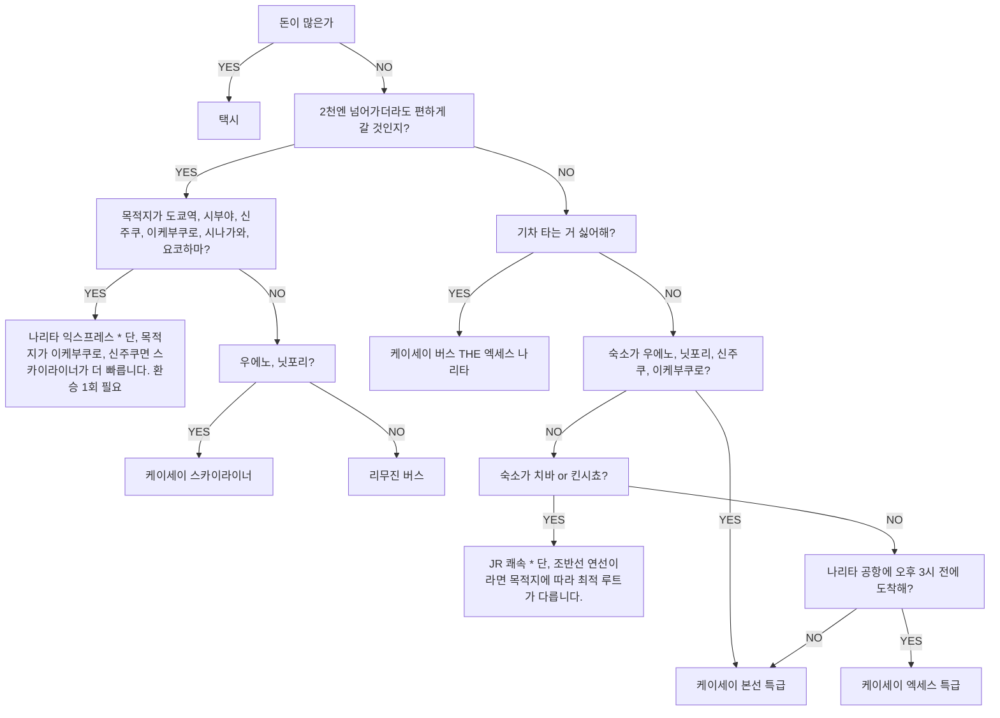

# 일본 공항 빠르게 가는 법

```mermaid
graph TD
    1[돈이 많은가]
    2[택시]
    3[2천엔 넘어가더라도 편하게 갈 것인지?]
    4[목적지가 도쿄역, 시부야, 신주쿠, 이케부쿠로, 시나가와, 요코하마?]
    5[나리타 익스프레스 * 단, 목적지가 이케부쿠로, 신주쿠면 스카이라이너가 더 빠릅니다. 환승 1회 필요]
    6[우에노, 닛포리?]
    7[케이세이 스카이라이너]
    8[리무진 버스]
    9[기차 타는 거 싫어해?]
    10[케이세이 버스 THE 엑세스 나리타]
    11[숙소가 우에노, 닛포리, 신주쿠, 이케부쿠로?]
    12[케이세이 본선 특급]
    13[숙소가 치바 or 킨시쵸?]
    14[JR 쾌속 * 단, 조반선 연선이라면 목적지에 따라 최적 루트가 다릅니다.]
    15[나리타 공항에 오후 3시 전에 도착해?]
    16[케이세이 엑세스 특급]

    1 --YES--> 2
    1 --NO--> 3
    3 --YES--> 4
    4 --YES--> 5
    4 --NO--> 6
    6 --YES--> 7
    6 --NO--> 8
    3 --NO--> 9
    9 --YES--> 10
    9 --NO--> 11
    11 --YES--> 12
    11 --NO--> 13
    13 --YES--> 14
    13 --NO--> 15
    15 --YES--> 16
    15 --NO--> 12
```
