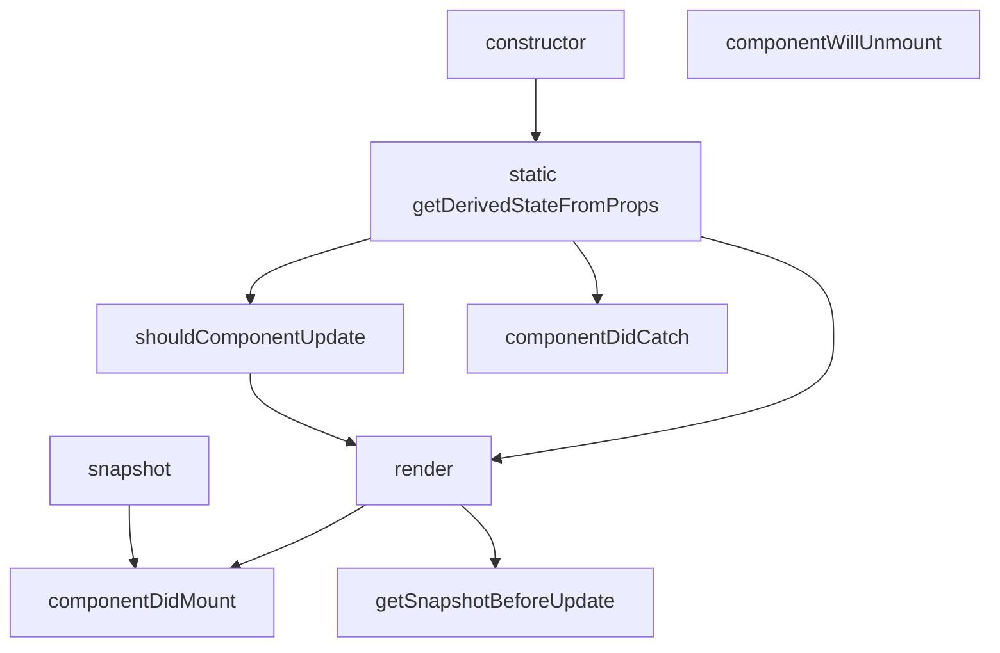

## Lifecycle

리액트 라이프사이클 정리

```mermaid
graph TD
    %% Mounting
    con[constructor] --> derived[static getDerivedStateFromProps]
    derived --> render[render]
    render --> did[componentDidMount]
    
    %% Updating
    derived --> should[shouldComponentUpdate]
    should --> render
    render --> snapshop[getSnapshotBeforeUpdate]
    snapshot --> did

    %% Unmounting
    will[componentWillUnmount]

    %% Error Handling
    derived --> catch[componentDidCatch]
```
