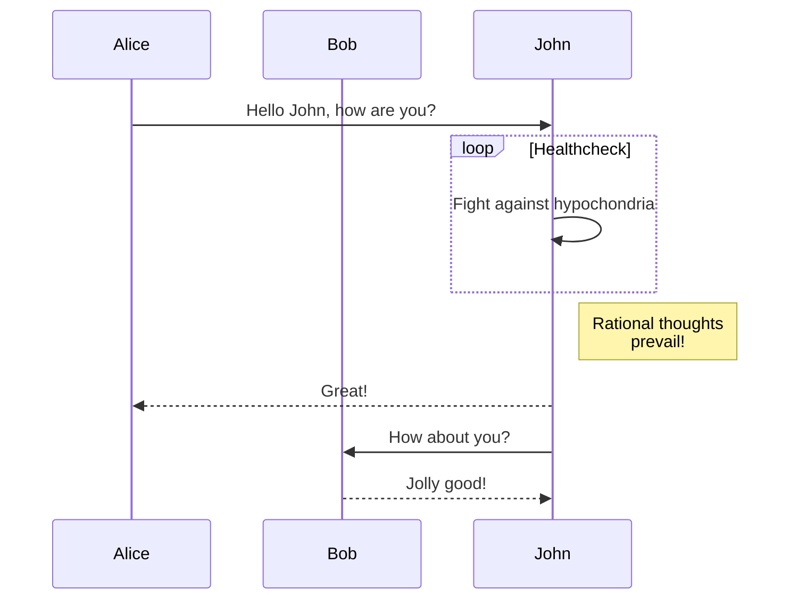
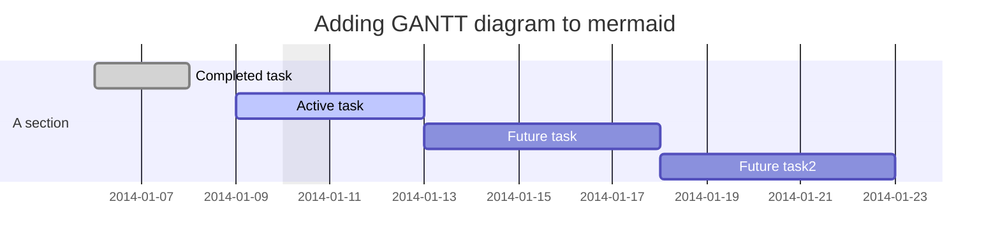
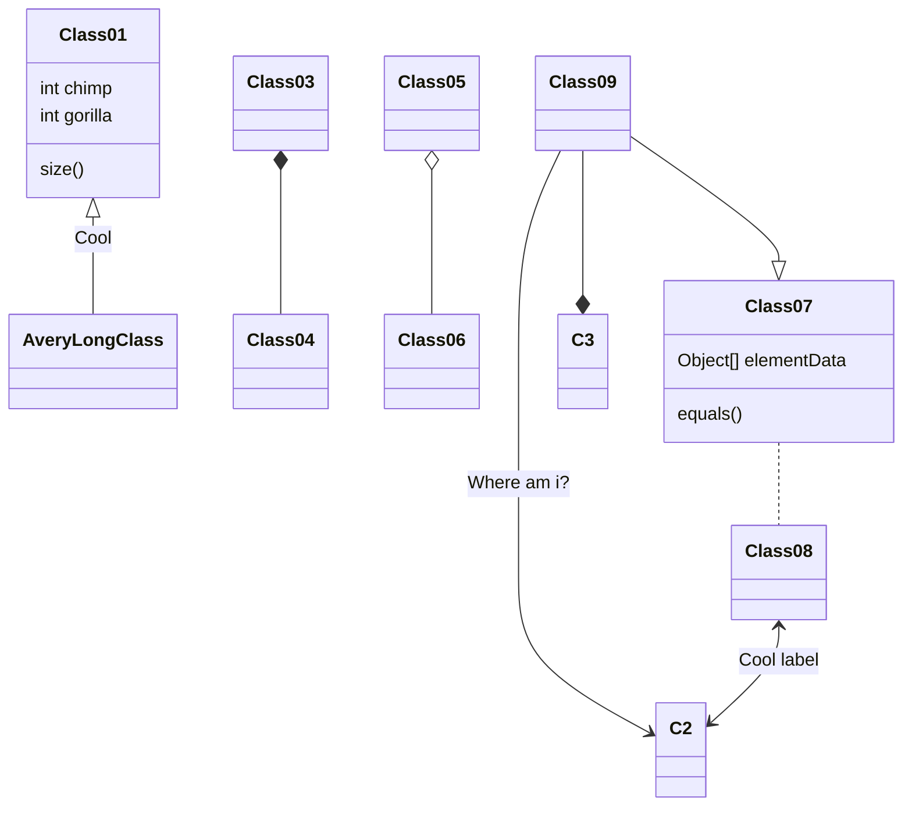
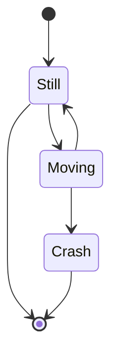
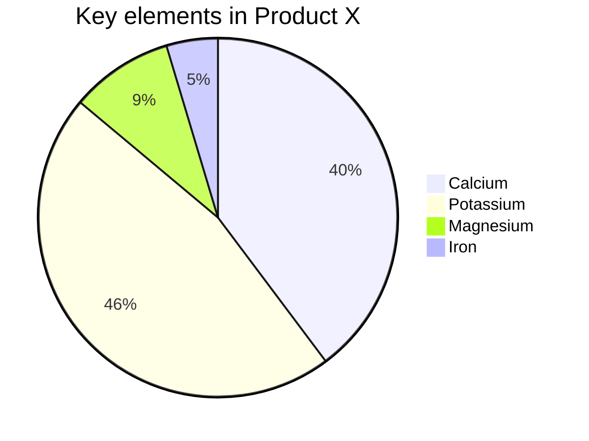

# Markdown

마크다운은 경량 마크업 랭귀지로 2004년 [John Gruber](https://daringfireball.net/projects/markdown/)가 제안했다.

## 텍스트 꾸미기

| Markdown | 결과 |
|:--------|:-------:|
|`**강조**`|**강조**|
|`__강조__`|__강조__|
|`*기울임*`|*기울임*|
|`_기울임_`|_기울임_|
|`_**강조기울임**_`|_**강조기울임**_|
|`~~취소선~~`|~~취소선~~|

## 인용

```markdown
> 인용문입니다.
>> 내부인용문입니다.
```

> 인용문입니다.
>> 내부인용문입니다.

## 번호 리스트

1. 아이템
2. 아이템
3. 아이템

## 번호없는리스트

* Item 1
  * Item 2
    * Item 3
  * Item 4
    1. 아이템
    2. 아이템
        * 아이템

## 소스코드

### 인라인 코드

```markdown
`인라인코드` 입니다.
```

`인라인코드` 입니다.

### 코드블럭

```markdown
코드블럭
```

## 이미지

```markdown

```


## 수평선

```markdown
---
___
```

---
___

## 링크

```markdown
[Google](https://google.com)
```

[Google](https://google.com)

```markdown
<https://google.com>
```

<https://google.com>

## 표

| Header 1 | Header 2 | Header 3 |
|:--------|:-------:|--------:|
| cell 1   | cell 2   | cell 3   |
| cell 4   | cell 5   | cell 6   |

## 특정 제목으로 이동

* 현재 템플릿에서 목차 이동 사용 불가

```markdown
[마크다운](#markdown)
```

[마크다운](#markdown)

## 체크박스

TODO

* [ ] TODO1
* [x] TODO2

## 주석

이것은 마크다운입니다[^1]

[^1]: 마크다운 주석입니다. [마크다운 문법 확인](https://github.com/DavidAnson/markdownlint/blob/v0.18.0/doc/Rules.md)

## LaTeX (MathJax)

[MathJax](https://www.mathjax.org/)

### 인라인 LaTex

This formula $f(x) = x^2$ is an example.

## 수식

$$
\lim_{x\to 0}{\frac{e^x-1}{2x}}
\overset{\left[\frac{0}{0}\right]}{\underset{\mathrm{H}}{=}}
\lim_{x\to 0}{\frac{e^x}{2}}={\frac{1}{2}}
$$

<!-- ## Github (github-embed)

### Github 첨부

<code data-github-path="https://github.com/devwock/devwock.github.io/blob/master/js/main.js"></code>

### 라인 넘버 표시

<code data-github-path="https://github.com/devwock/devwock.github.io/blob/master/js/main.js" data-github-show-line-numbers="true"></code>

### 하단 Footer 표시

<code data-github-path="https://github.com/devwock/devwock.github.io/blob/master/js/main.js" data-github-show-footer="true"></code>

### 라인 넘버와 Footer 표시

<code data-github-path="https://github.com/devwock/devwock.github.io/blob/master/js/main.js" data-github-show-line-numbers="true" data-github-show-footer="true"></code>

### 파일 제목 추가

<code data-github-path="https://github.com/devwock/devwock.github.io/blob/master/js/main.js" data-github-caption="/this/is/path"></code>

### 파일 제목 추가 + Footer 표시

<code data-github-path="https://github.com/devwock/devwock.github.io/blob/master/js/main.js" data-github-caption="/this/is/path" data-github-show-footer="true"></code>

### 특정 라인 첨부 (2)

<code data-github-path="https://github.com/devwock/devwock.github.io/blob/master/_includes/read_time.html" data-github-show-line-numbers="true" data-github-show-footer="true" data-github-line="2"></code>

### 특정 라인 범위 첨부 (2 ~ 4)

<code data-github-path="https://github.com/devwock/devwock.github.io/blob/master/_includes/read_time.html" data-github-show-line-numbers="true" data-github-show-footer="true" data-github-line="2-4"></code>

### 특정 라인과 범위 첨부 (1, 3 ~ 4)

<code data-github-path="https://github.com/devwock/devwock.github.io/blob/master/_includes/read_time.html" data-github-show-line-numbers="true" data-github-show-footer="true" data-github-line="1, 3-4"></code>

### 하이라이팅 (1, 3, 5)

<code data-github-path="https://github.com/devwock/devwock.github.io/blob/master/_includes/read_time.html" data-github-show-line-numbers="true" data-github-show-footer="true" data-github-line="1-5" data-github-highlight-line="1, 3, 5"></code>

## Github Gist (git-embed)

[Gist Embed](https://github.com/bvanderhoof/gist-embed)

### Gist 첨부

<code data-gist-id="bfc347b261aa74f8578e0f75dbb5c497"></code>

### 라인 넘버 제거

<code data-gist-id="ec8cc541c45705a34988c68225627ecb" data-gist-hide-line-numbers="true"></code>

### 하단 Footer 제거

<code data-gist-id="f9ab62428c11acd00ae087f4230c7dec" data-gist-hide-footer="true"></code>

### 라인 넘버와 Footer 제거

<code data-gist-id="dc877edb5e3c26edca5b4b9ecbb69b62" data-gist-hide-footer="true" data-gist-hide-line-numbers="true"></code>

### 파일 제목 추가

<code data-gist-id="7baadc508ee2f81164984f3dda7396eb" data-gist-caption="this/is/a/sample/path/to/file.extension"></code>

### 파일 제목 추가 + Footer 제거

<code data-gist-id="6ace96ce3cb069a31d00aad4d3028497" data-gist-hide-footer="true" data-gist-caption="this/is/a/sample/path/to/file.extension"></code>

### 한 Gist에 모든 파일 첨부

<code data-gist-id="5d38ea50df686b72d6801dca13387baa"></code>

### 한 Gist에 특정 파일 첨부

<code data-gist-id="5d38ea50df686b72d6801dca13387baa" data-gist-file="example7-file2.html"></code>

### 특정 라인 첨부 (2)

<code data-gist-id="47294f914dce7472c2c85874cb1ba424" data-gist-line="2"></code>

### 특정 라인 범위 첨부 (2 ~ 4)

<code data-gist-id="bd6b034b373ce5af87b513f68be30799" data-gist-line="2-4"></code>

### 특정 라인과 범위 첨부 (1, 3 ~ 4)

<code data-gist-id="deb8c41ee013c615a2bf3a7468e5c008" data-gist-line="1,3-4"></code>

### 하이라이팅 (1, 3, 5)

<code data-gist-id="81a92a00cf2472820ad1795fab2c7449" data-gist-highlight-line="1,3,5"></code> -->

## Mermaid

[Mermaid](https://mermaid-js.github.io/mermaid/#/)

### 플로우차트


### 시퀀스 다이어그램



### 간트 차트



### 클래스 다이어그램



### Git 그래프


### 스테이트 다이어그램



### 파이 차트


