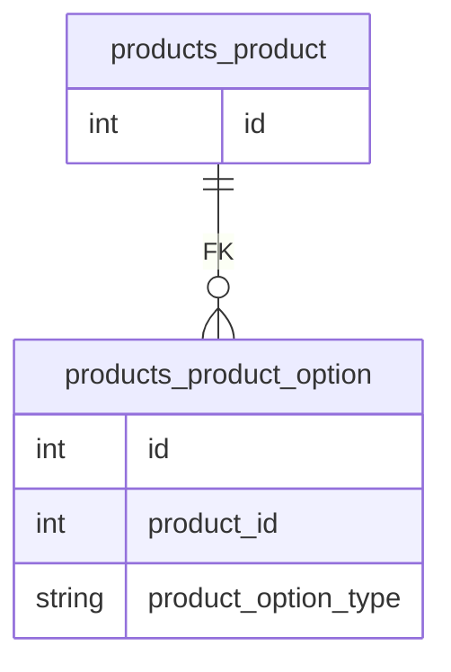

# Django Reverse Foreign Key Filter

## 개요

Django ORM에서 Reverse Foreign Key를 필터링 할 때 두가지 방법이 있다.

1. 서브쿼리와 `annotation`, `OuterRef`를 사용
2. 모델에 설정한 `related_name`을 이용한 역참조 필터링

1번 방법은 다양한 조건문을 걸거나 기존 `QuerySet`에 미리 만들어놓은 `filter`를 사용할 수 있는 장점이 있고, 2번 방법은 코드가 간단해지는 장점이 있다.

## 테이블 구조

- Product
  - id: int
- ProductOption  
  - id: int
  - product_id: Product의 FK
  - product_option_type: string



## Reverse Foreign Exclude 필터링

### Django ORM

```python
Product.objects.exclude(
    product_product_promotions__product_promotion_type__in=('TYPE_1', 'TYPE_2')
)
```

### SQL

```sql
SELECT
    products_product.id
FROM
    products_product
WHERE
    NOT (
        products_product.id IN (
            SELECT
                U1.product_id
            FROM
                promotions_productpromotion U1
            WHERE (
                    U1.product_promotion_type IN ('TYPE_1','TYPE_2')
                AND U1.product_id IS NOT NULL
            )
        )
    )
;
```

### Query Explain

| id | select_type | table            | partitions | type  | possible_keys     | key      | key_len | ref | rows | filtered | Extra                              |
|:---|:------------|:-----------------|:-----------|:------|:------------------|:---------|:--------|:----|:-----|:---------|:-----------------------------------|
| 1  | PRIMARY     | products_product | -          | index | -                 | CENSORED | 5       | -   | 9812 | 100      | Using where; Using index           |
| 2  | SUBQUERY    | U1               | -          | range | CENSORED,CENSORED | CENSORED | 258     | -   | 181  | 50       | Using index condition; Using where |

## `annotation`과 subquery를 이용한 exclude 필터링

### Python

```python
Product.objects.annotate(
    _has_special_deal=Exists(
        ProductOption.objects.filter(product_id=OuterRef('id')).filter(
            product_option_type__in=('TYPE_1','TYPE_2')
        )
    )
).filter(_has_special_deal=False)
```

### SubQuery SQL

```sql
SELECT
    products_product.id,
    EXISTS(
        SELECT
            U0.id
        FROM
            promotions_productpromotion U0
        WHERE (
                U0.product_promotion_type IN ('TYPE_1', 'TYPE_2')
            AND U0.product_id = products_product.id
        )
    ) AS _has_special_deal
FROM
    products_product
WHERE
    NOT EXISTS(
        SELECT
            U0.id
        FROM
            promotions_productpromotion U0
        WHERE (
                U0.product_promotion_type IN ('TYPE_1', 'TYPE_2')
            AND U0.product_id = products_product.id
        )
    )
;
```

### SuqQuery Explain

| id | select_type        | table            | partitions | type   | possible_keys     | key               | key_len | ref                          | rows  | filtered | Extra                   |
|:---|:-------------------|:-----------------|:-----------|:-------|:------------------|:------------------|:--------|:-----------------------------|:------|:---------|:------------------------|
| 1  | PRIMARY            | products_product | -          | index  | -                 | CENSORED          | 5       | -                            | 9812  | 100      | Using index             |
| 1  | PRIMARY            | subquery3        | -          | eq_ref | auto_distinct_key | auto_distinct_key | 5       | CENSORED.products_product.id | 1     | 100      | Using where; Not exists |
| 3  | MATERIALIZED       | U0               | -          | ALL    | CENSORED,CENSORED | -                 |         | -                            | 31813 | 100      | Using where             |
| 2  | DEPENDENT SUBQUERY | U0               | -          | ref    | CENSORED,CENSORED | CENSORED          | 5       | CENSORED.products_product.id | 4     | 1.11     | Using where             |

## 결론

`annotation`을 이용하여 `filter`를 하면, reverse foreign 필터와 `WHERE`절은 같지만 `annotation`으로 인해 Subquery가 `SELECT` 절에도 생기게 된다.

Query Explain결과도 `type`을 보면 `index` -> `range`에서 `index` -> `eq_ref` -> `ALL` -> `ref`로 단계가 훨씬 늘어나고, 심지어 풀스캔을 도는것을 확인할 수 있다. (해당 부분은 인덱스 설정 방법에 따라 달라질 수 있다.)

따라서 별도로 `annotation`을 이용한 필드가 필요한것이 아닌 단순 `filter` 용이라면 되도록 `annotation` 사용을 지양해야한다.
