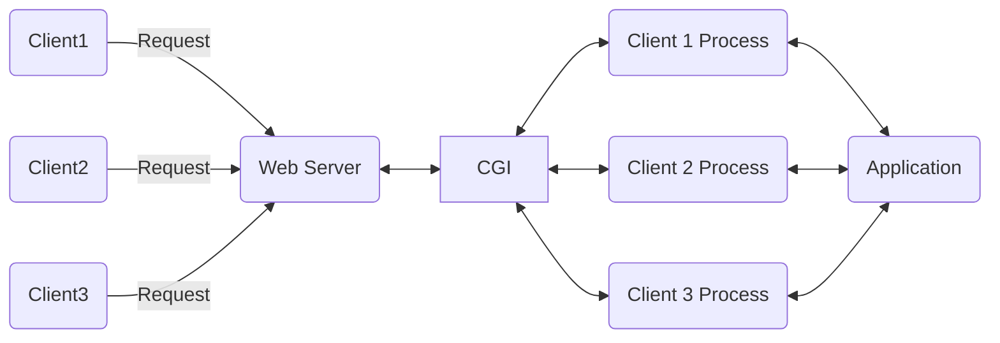
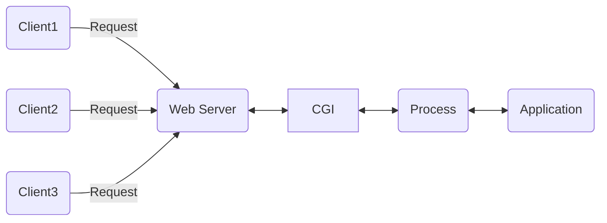

# CGI

## CGI 개요

CGI란 `Common Gateway Interface`의 약자로 웹 서버(Apache Web Server, nginx 등등)과 애플리케이션을 연결해주는 인터페이스이다.



CGI는 요청이 들어올 때 마다 Process를 fork하기 때문에 요청이 과도하면 오버헤드가 매우 심해진다.

## FastCGI

FastCGI는 단일 프로세스에서 여러 요청을 처리하기 때문에 이러한 오버헤드가 감소한다.  
프로세스는 웹 서버가 아닌 FastCGI 서버가 관리한다.  
대표적으로 `Tomcat`이 FastCGI를 사용한다.



## 파이썬

### WSGI

WSGI는 파이썬의 CGI 개념 구현으로 (CGI와 완전히 같지 않음) `Web Server Gateway Interface`의 약자로, 요청이 들어올 때 Process를 fork하는 것이 아닌 callback 구조로 처리한다.  
그리고 중간에서 인증이나 쿠키 등을 관리하는 Middleware가 존재한다. (ex: `gunicorn`)
이러한 구현에는 두가지 방법이 있다.

1. Web Server에서 제공하는 server-often high profile 사용 (웹 서버 내장 인터프리터, ex: `mod-python`)
   - 실행 시 캐싱을 하기 때문에 파일 내용이 바뀌면 웹 서버가 재시작한다.
   - `mod_python`은 특정 버전 파이썬 라이브러리에 의존적
2. Python에서 작성된 프로그램 사용 (ex: `gunicorn`)

WSGI는 다음 파라미터를 받는다.

- `environ`: 웹 서버가 제공하는 [환경변수](https://peps.python.org/pep-0333/#environ-variables)와 요청에 대한 정보
- `start_response`: http 응답을 보내는데 사용할 callback method

간단하게 구현하면 다음과 같다.

```python
def application(environ, start_response):
    start_response("200 OK", [("Content-Type", "text/plain")])
    return [b"Hello, World!"]
```

WSGI 호환 웹 프레임워크를 사용할 경우 프레임워크에서 `application` 함수를 제공하기 때문에 자동으로 연결된다.

#### 단점

- 한 번에 한 가지 요청에 대해 응답을 처리한다.
- 응답이 즉시 반환된다고 전제한다.
  - 이로 인해 장시간 지속되는 웹 소켓등의 연결을 처리할 방법이 없다.
  - Celery같은 비동기 큐를 사용할 수 있지만 유지보수가 쉽지 않다.
- 동기 전용이다. 멀티 스레드를 사용해도 응답이 반환될 때 까지 연결이 차단된다.

### ASGI

ASGI는 `Asyncronous Server Gateway Interface`의 약자로, WSGI의 상위 호환이며 파이썬의 표준 API이다.

ASGI의 매개변수는 다음과 같이 구성된다.

- `scope`: 현재 요청에 대한 정보, WSGI의 `environ`과 유사하나 세부적인 명명이 다름
- `send`: 앱이 http 응답을 보내는데 사용할 async callback method
- `receive` 앱이 클라이언트로부터 메세지를 수신하는데 사용할 async callable method

간단하게 구현하면 다음과 같다.

```python
async def application(scope, receive, send):
    await send({
        "type": "http.response.start",
        "status": 200,
        "headers": [
            [b"content-type", b"text/plain"],
        ]
    })

    await send({
        "type": "http.response.body",
        "body": b"Hello, World!"
    })
```

가장 큰 특징은 함수 전반에서 비동기 메타포를 사용하는 것이다. 응답 본문을 두 개의 `await send()`로 전달하기 때문에 이 과정에서 block되지 않는다.  
위 구현에서 `receive()`는 구현되지 않았지만 이 역시 async로 구현된다.

#### 사용할 수 있는 프레임워크/라이브러리

- Uvicorn: 내장 모듈로 uvloop 사용, uv는 libuv를 사용하며 이는 V8엔진의 비동기 모듈을 사용한다. Cython 기반으로 C++언어로 작성되었다.
- FastAPI
- Flask
- Django 3.0+
